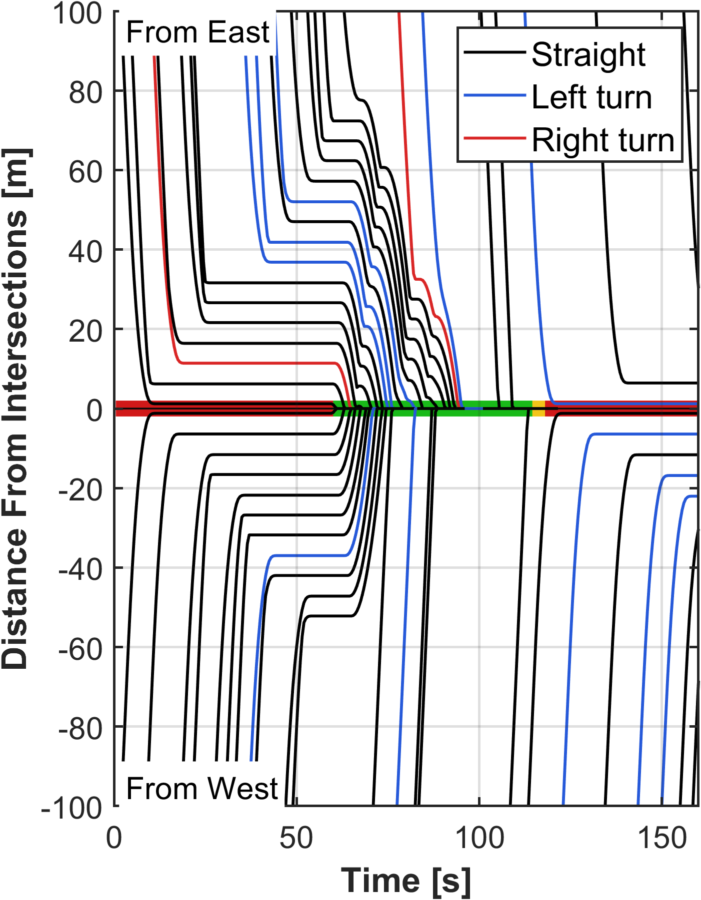
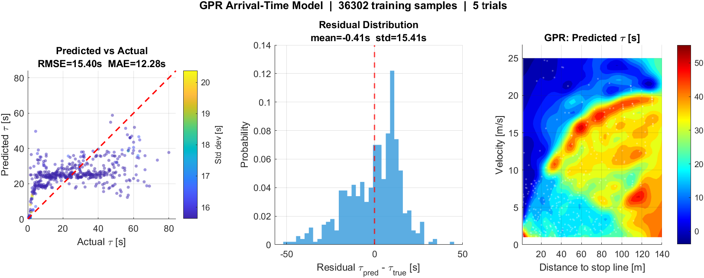

# Learning-Based Optimal Right-Turn Coordination for Connected and Automated Vehicles

MATLAB simulation for my master's research at **Gunma University (Kamal Laboratory)**. It studies how
Connected and Automated Vehicles (CAVs) can turn right efficiently at signalized intersections in
**left-hand traffic** (Japan).

📄 **Paper:** [Learning-Based Optimal Right-Turn Coordination System for Connected and Automated Vehicles at Intersections](https://drive.google.com/file/d/1eD-5lxTvvwlGY6lJCwVpVNrC4kos1YCi/view?usp=sharing)
*Phearamony Phan, Mahmudul Hasan, A. S. M. Bakibillah, Md Abdus Samad Kamal, Kou Yamada*.
SICE Festival 2026 (SICE Annual Conference), Yokohama, Japan.



---

## The problem

At many Japanese intersections there is no dedicated right-turn lane or protected arrow. A right-turning
car has to wait at the stop line for a gap in the oncoming traffic. While it waits, every car behind it
is blocked. The queue can spill over into the next red phase, which wastes time and fuel.

## The proposed system

A Road Side Unit (RSU) at the intersection collects vehicle states over V2X and plans a gap for each
right-turning vehicle at the start of every green phase.

1. **Bayesian GPR arrival-time estimator:** a Gaussian Process Regression model, trained offline on
   driving data, predicts when each vehicle will reach the stop line from its distance and speed `(d, v)`.
   It always returns a finite estimate (IDM forward simulation fails in 18.1% of cases).
2. **Slot-search optimizer (RSU):** finds the insertion slot in the oncoming stream that minimizes total
   squared delay, then assigns a coordinated crossing time to every vehicle.
3. **QP-MPC controller:** each CAV runs a finite-horizon quadratic-programming MPC that tracks its
   assigned crossing time while respecting acceleration and safe-gap constraints.

## Key results

A factorial ablation was run with identical stochastic traffic, signal timing and geometry for every
configuration (`output/ablation_summary.csv`):

| Config | Controller | RSU estimator | Right-turn fuel [mL] | Straight fuel [mL] | Gap wait [s] |
|---|---|---|---|---|---|
| C1: human driving | IDM + noise | none | 67.59 | 34.45 | 42.32 |
| C2: reference | IDM | IDM | 60.35 | 45.53 | 24.20 |
| C2G | IDM | GPR | 60.35 | 45.53 | 24.20 |
| C3I | QP-MPC | IDM | 42.90 | 36.38 | 28.50 |
| **C3: proposed** | **QP-MPC** | **GPR** | **42.90** | **36.38** | **28.50** |

* **37% lower right-turn fuel consumption** than uncoordinated human driving.
* Most of the fuel benefit comes from pairing QP-MPC with RSU-assigned crossing times. MPC brakes once
  and smoothly, while IDM misses its slot and oscillates.
* GPR gives the same slot assignments as IDM forward simulation at a fraction of the compute cost: one
  closed-form evaluation instead of up to 120 simulated steps per vehicle.



---

## Repository structure

```
class/      Car.m (IDM / QP-MPC vehicle), RSU.m (V2X buffer, GPR estimator, slot search)
function/   IDM, trajectory / acceleration / fuel plotting, ablation metrics
main/       Simulation entry points (one script per configuration)
simplot/    Intersection drawing, initial values, trained GPR model, shared traffic schedule
output/     Generated figures, videos and ablation summary
```

### Main scripts

| Script | Configuration |
|---|---|
| `main/main_human_driving.m` | C1: uncoordinated human driving (IDM + noise) |
| `main/main_v2v_idm.m` | V2V-only IDM baseline |
| `main/main_v2v_idm_rsu.m` | C2: IDM + RSU (IDM estimator) |
| `main/main_v2v_idm_rsu_gpr.m` | C2G: IDM + RSU (GPR estimator) |
| `main/main_v2v_mpc.m` | V2V-only QP-MPC baseline |
| `main/main_v2v_mpc_rsu.m` | C3I: QP-MPC + RSU (IDM estimator) |
| `main/main_v2v_mpc_rsu_gpr.m` | **C3: proposed system** |
| `main/main_human_driving_gpr_train.m` | Collect data and train the GPR arrival-time model |
| `main/main_estimator_compare.m` | Compare GPR, IDM forward simulation and the naive `d/v` estimator |
| `main/demo_main.m` | Light-traffic demo with live intersection and trajectory animation |

## Getting started

Requirements: **MATLAB** (R2023a or newer recommended) with the Optimization Toolbox (`quadprog`) and the
Statistics and Machine Learning Toolbox (GPR).

```matlab
% from the repo root
cd main
demo_main          % quick visual demo of the proposed system
```

The demo adds `class/`, `function/` and `simplot/` to the path automatically. The other `main_*.m`
scripts use absolute `addpath` lines from my machine, so change them to your clone location before
running them.

## Related repositories

* [Traffic_Intersection_Simulation_5G](https://github.com/Phearamony/Traffic_Intersection_Simulation_5G):
  extends this simulation to send real vehicle data over a network, as a step toward real-world testing
  over 5G.

## Citation

```bibtex
@inproceedings{phan2026rightturn,
  title     = {Learning-Based Optimal Right-Turn Coordination System for Connected and Automated Vehicles at Intersections},
  author    = {Phan, Phearamony and Hasan, Mahmudul and Bakibillah, A. S. M. and Kamal, Md Abdus Samad and Yamada, Kou},
  booktitle = {SICE Festival 2026 (SICE Annual Conference)},
  address   = {Yokohama, Japan},
  year      = {2026}
}
```

## Acknowledgment

Supported by JSPS Grants-in-Aid for Scientific Research (C) 26K07547 and the Rotary Yoneyama Memorial
Foundation Scholarship.
